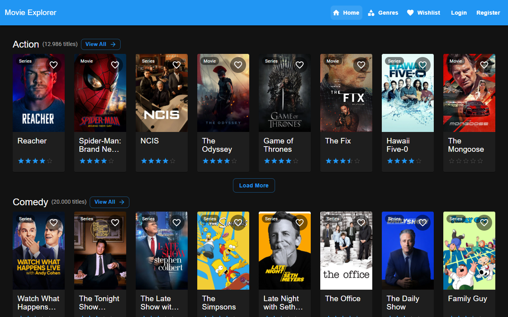

# movie-db-webapp

[](https://github.com/CMaintz/movie-db-webapp/actions/workflows/ci.yml)

My TMDB browser: a single-page app for browsing movies and TV shows from [TMDB](https://www.themoviedb.org/), with Firebase sign-in and a personal wishlist in Firestore. Basically a place to park "we should watch that sometime" before it's forgotten.

It also spawned [MovieWheel](https://github.com/CMaintz/movie-wheel), which deals with the other half of the problem: actually picking something tonight. (There was a webOS TV version of this app at some point too; it isn't in this repo.)

Live demo: https://cmaintz.github.io/movie-db-webapp/



## What you can do

- Genre browsing: the home page shows nine fixed genres. Each row merges movies and TV shows, sorted by popularity, and has "Load more".
- Genre pages (`/genre/:genreName`): All / Movies / TV tabs, with pagination capped at TMDB's 500-page limit.
- Details pages (`/movie/:id`, `/tv/:id`): overview, rating, director or creators, a cast carousel, the YouTube trailer, and seasons for TV.
- Accounts: email/password sign-up and login through Firebase Authentication, plus an editable display name.
- Wishlist: signed-in users can save titles from any card or details page. Items are stored per user in Firestore and shown on `/wishlist`.
- Layout: dark theme, with a bottom navigation bar on small screens.

## Tech stack

React 19, TypeScript, Material UI 7, TanStack Query 5, React Router 7, Axios, Firebase (Auth + Firestore), Vite 6, Vitest and Testing Library.

## Architecture

```
Browser ──► TMDB REST API          (movie/TV data, read-only)
   │
   ├──► Firebase Auth              (email/password sessions)
   └──► Cloud Firestore            users/{uid}/wishlist/{doc}
```

There is no backend. Everything runs in the browser and is served as static files from GitHub Pages.

| Layer | Location | Responsibility |
| --- | --- | --- |
| TMDB client | `src/services/apiService.ts` | Axios instance plus React Query hooks. Normalises TMDB's movie/TV field differences (`title`/`name`, `release_date`/`first_air_date`) into one `Media` shape and clamps pagination to TMDB's limits. |
| Wishlist store | `src/services/wishlistService.ts` | Firestore reads and writes under `users/{uid}/wishlist`. |
| Wishlist state | `src/hooks/useWishlist.ts` | One shared React Query cache per user. Add and remove are optimistic mutations that roll back if Firestore rejects them, so every wishlist button updates together. |
| Genre data | `src/hooks/useGenreMedia.ts` | Fetches a genre's movies and TV shows in parallel, then merges and de-duplicates them. |
| Auth | `src/context/` | Firebase auth state exposed through `useAuth()`. `ProtectedRoute` redirects signed-out users to `/login`. |
| Security rules | `firestore.rules` | A user can only read, create or delete their own wishlist documents, and created documents are schema-checked. |

```
src/
├── components/        # Cards, grid, navbar, pagination, wishlist button, ProtectedRoute
│   └── media-details/ # Sections of the details page
├── context/           # AuthProvider and useAuth
├── hooks/             # useWishlist, useGenreMedia
├── pages/             # Route components
├── services/          # TMDB, Firebase and Firestore access
├── test/              # Test setup, render helpers, in-memory Firestore fake
├── utils/             # Genre mapping, date/runtime formatting
├── types.ts
└── theme.ts
```

## Scope and limitations

- Client-only, so the TMDB key is public. The key is compiled into the JavaScript bundle and anyone can read it. Hiding it would need a small proxy (for example a serverless function); that is out of scope here. The Firebase web config is public by design, and access is enforced by `firestore.rules`.
- Fixed genres. The nine genres are hard-coded in `src/utils/genreMap.ts`. TMDB keeps separate genre lists for movies and TV. Thriller and War map to the nearest TV genres (Mystery, War & Politics). Romance and Horror have no TV equivalent, so those rows are effectively movie-only.
- English-language results only. Queries filter on `with_original_language=en`.
- Not included: search, password reset, social login, and wishlist sorting or notes.
- Tests: they cover the services, hooks, formatting utilities, route guard, auth provider and several components and pages (roughly half of all lines). Home, Login, Register, Navbar and the details page are not tested yet. On the list.

## Getting started

Prerequisites: Node 22 (see `.nvmrc`), a [TMDB API key](https://www.themoviedb.org/settings/api), and a Firebase project with Email/Password auth and Firestore enabled.

```bash
git clone https://github.com/CMaintz/movie-db-webapp.git
cd movie-db-webapp
npm ci
cp .env.example .env.local   # then fill in the values
npm run dev
```

`.env.local` needs:

```
VITE_TMDB_API_KEY=
VITE_FIREBASE_API_KEY=
VITE_FIREBASE_AUTH_DOMAIN=
VITE_FIREBASE_PROJECT_ID=
VITE_FIREBASE_STORAGE_BUCKET=
VITE_FIREBASE_MESSAGING_SENDER_ID=
VITE_FIREBASE_APP_ID=
```

## Scripts

| Command | What it does |
| --- | --- |
| `npm run dev` | Vite dev server |
| `npm run typecheck` | `tsc -b` over the app, tests and config |
| `npm run lint` | ESLint, with warnings treated as errors |
| `npm test` | Vitest, run once |
| `npm run test:coverage` | Vitest with a V8 coverage report; fails under the thresholds in `vitest.config.ts` |
| `npm run build` | Production build into `dist/` |

## Testing

Tests sit next to the code as `*.test.ts(x)` and run in jsdom. Firebase is never contacted:

- `src/test/setup.ts` replaces the Firebase app module.
- `src/test/fakeFirestore.ts` is an in-memory stand-in for the Firestore calls the app makes. `useWishlist` and `wishlistService` are tested end to end against it, including optimistic updates shared between components and failed writes.
- TMDB calls are mocked at the Axios boundary.

## CI and deployment

- CI (`.github/workflows/ci.yml`) runs on pushes to `master` and on pull requests: typecheck, lint, tests with coverage thresholds, then build.
- Deploy (`.github/workflows/deploy.yml`) runs on push to `master`. It builds with the `VITE_*` values from repository secrets and publishes to GitHub Pages with `actions/deploy-pages`. It also writes `404.html` as a copy of `index.html` so deep links survive a refresh. Pages must be set to deploy from GitHub Actions.
- Firestore rules are deployed separately:

  ```bash
  npx firebase-tools deploy --only firestore:rules --project <your-project-id>
  ```

  Or paste `firestore.rules` into Firebase console -> Firestore -> Rules.

## Attribution


This product uses the TMDB API but is not endorsed or certified by TMDB.

## License

[MIT](LICENSE)
