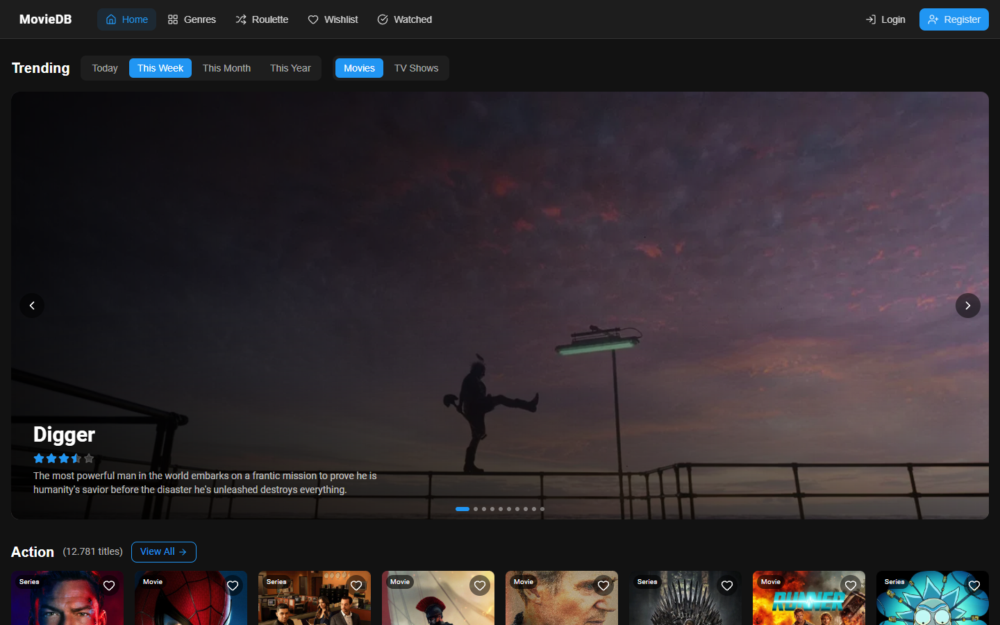
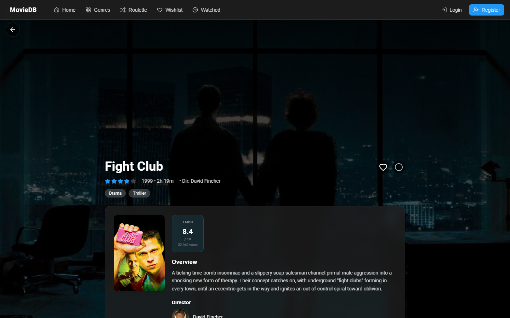
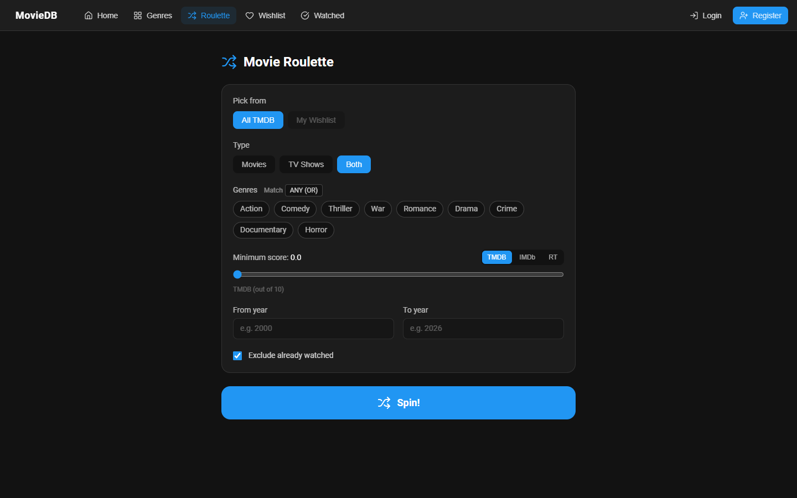

# movie-db-webapp

A movie and TV browser that runs in the browser and as a sideloaded app on my LG webOS TV, where you drive it with the remote's D-pad. It pulls everything from TMDB, adds IMDb and Rotten Tomatoes scores via OMDb, shows which streaming services carry a title in your country, and on the TV it can launch straight into the right streaming app.

Live (web build): https://cmaintz.github.io/movie-db-webapp/

The live build doesn't have OMDb or streaming-availability keys, so IMDb/RT scores and per-title deep links only show up locally with those keys set.



<p>
  
  
</p>

## What it does

- Trending, genre pages and detail pages with cast, trailers and similar titles
- Ratings from TMDB, IMDb and Rotten Tomatoes (OMDb, cached in Firestore for 30 days so the free tier lasts)
- Streaming availability per country. Region comes from your saved setting, then config, then IP lookup, then `US`
- Deep links into streaming services. On webOS they launch the target app with Luna launch params
- Roulette: can't decide, spin for a random title filtered by genre, year, minimum score and the services you pay for, from all of TMDB or just your wishlist. [MovieWheel](https://github.com/CMaintz/movie-wheel) started as a spin-off of this feature
- Firebase email/password login with wishlist, watched list and settings in Firestore
- TV mode: spatial navigation for the remote, media keys, safe-area padding, 1080p layout that the TV upscales

## Stack

React 19, TypeScript, Vite, Tailwind, TanStack Query, React Router 7 (`HashRouter`, because webOS loads the app from a file path), Firebase Auth + Firestore, norigin-spatial-navigation for the D-pad. APIs: TMDB v3/v4, OMDb, Streaming Availability (movieofthenight), ip-api.com.

## Running it

Needs Node 22 (pinned in `mise.toml`).

```bash
npm install
cp .env.example .env   # TMDB + Firebase are required, the rest is optional
npm run dev
```

For the TV, copy `public/appconfig.example.js` to `public/appconfig.js` and put the keys there instead. It loads before the bundle, so keys can be changed on the TV without rebuilding. Then, with [ares-cli](https://webostv.developer.lge.com/develop/tools/cli-introduction) and the TV in developer mode:

```bash
npm run build:tv     # build + webOS manifest and icons
npm run install:tv   # package the .ipk and sideload it
npm run launch:tv
npm run inspect:tv   # remote DevTools
```

`firestore.rules` keeps each user's wishlist, watched list and settings readable and writable only by that user. Deploy with `firebase deploy --only firestore:rules`.

## Tests and CI

```bash
mise run gate   # lint, typecheck, vitest with coverage floor, npm audit
npm test        # just the tests
```

50 Vitest tests across 5 files, covering the pure bits: genre mapping, release-date handling, cast/crew shaping, platform detection and the provider/deep-link mapping for streaming services. PRs run the Foundry gate (the same `mise run gate`, plus structural smell checks, gitleaks, semgrep and a guard against loosening lint rules in the same PR as code changes). Pushes to `main` build the web version and deploy it to Pages.

## Limitations

- Coverage is low, around 4% of lines. The thresholds in `vite.config.ts` are a floor that only goes up, but the components and hooks are mostly untested
- The web build gets its keys baked in at build time, so the TMDB/OMDb keys are visible in the bundle. Fine for free-tier keys, not for anything that costs money
- Deep links are most useful on webOS. In the browser they just open the title on the service's site in a new tab, or TMDB's where-to-watch page if there's no link
- On the Pages build, `appconfig.js` doesn't exist, so that request 404s and the app falls back to the baked-in keys. Harmless, just noise in the console

## History

This repo used to hold my first version of the app, built with MUI. I rewrote it with Tailwind and the webOS target in a separate private repo and moved that back here. The old commits are still in the history.

## License

MIT
